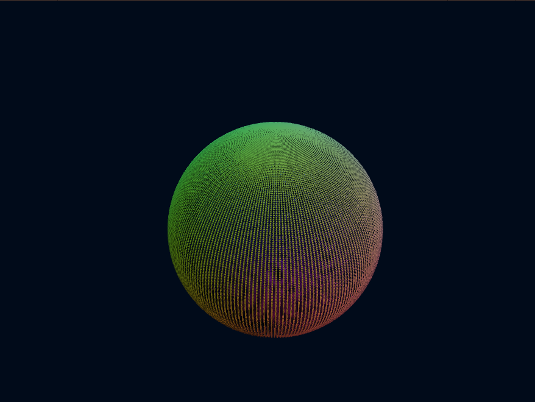
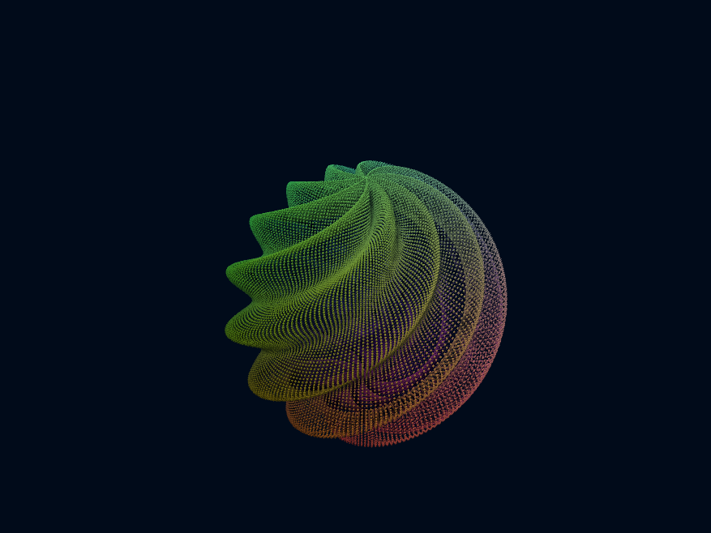
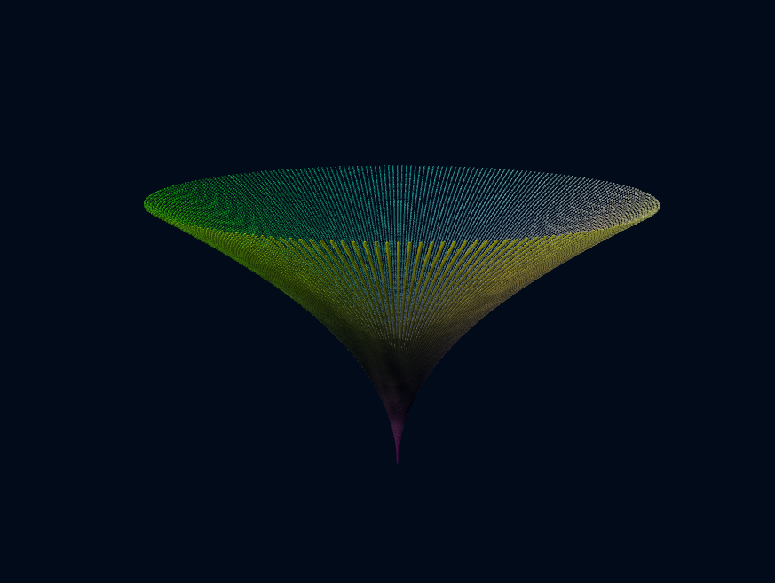
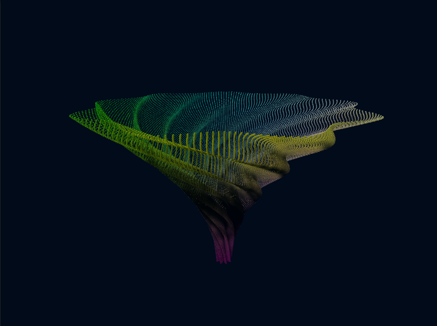
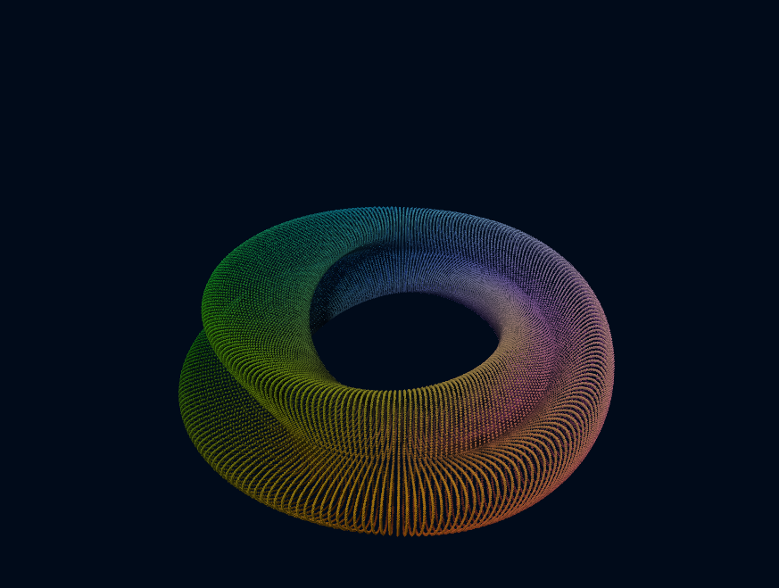

# Parametric Surfaces
Contemplative Scene showing animated 3D Surfaces calculated with a Compute Shader. 
[Go to project](https://github.com/TutanDev/UnityPortfolio/tree/master/Assets/ParametricSurfaces)

Contemplative Scene where 3 different animated Mathematical surfaces are drown.

The points of the surfaces are drown proceduraly with cubes colored based on the world position.

The calculation ob the points positions is done using a Compute Shader.

## Surfaces

The code contains 3 surfaces and the logic to transition between them:

### Sphere

### Paraboloid

### Kleant Bottle

