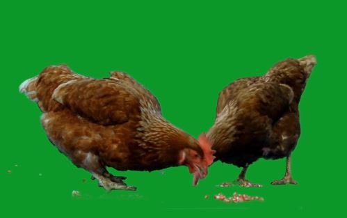

<!-- [Go to project](https://github.com/TutanDev/UnityPortfolio/tree/master/Assets/TransparentChromaShader) -->

The shader comes with a custom inspactor, creating this I learnt abote ShaderGUI and MaterialEditor classes.

